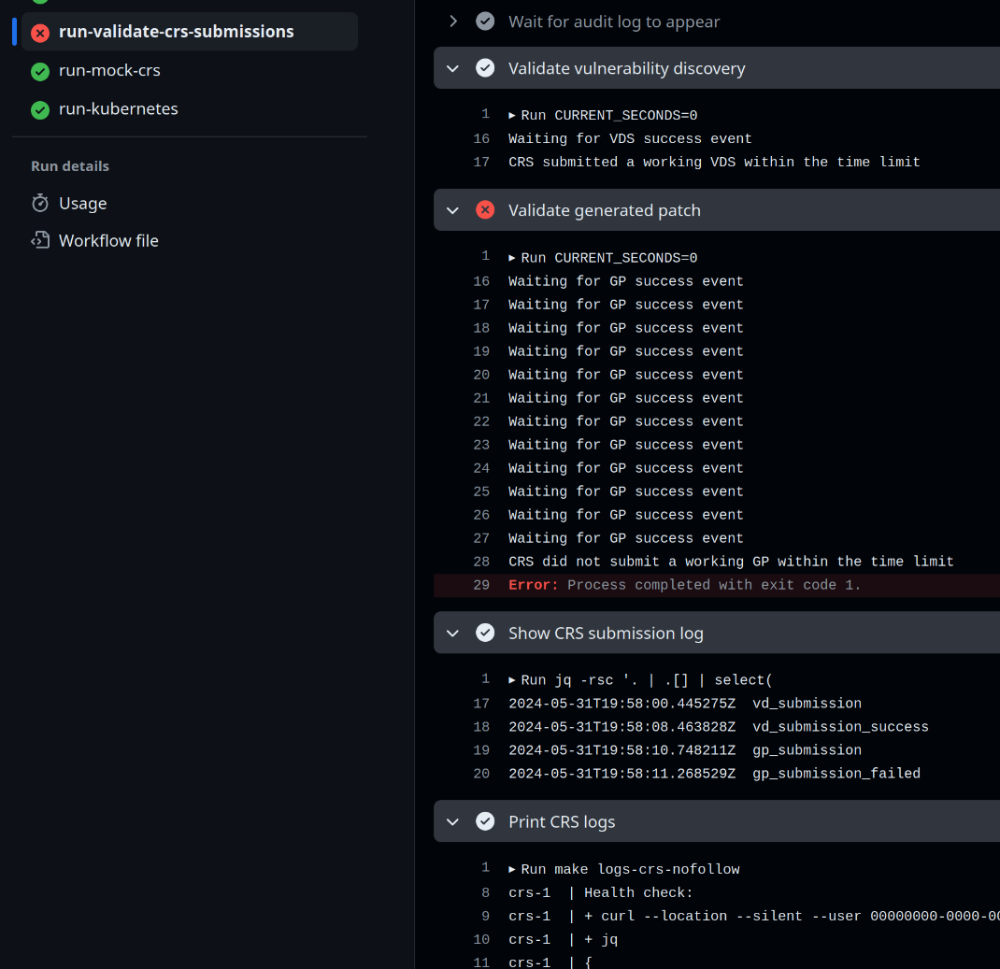
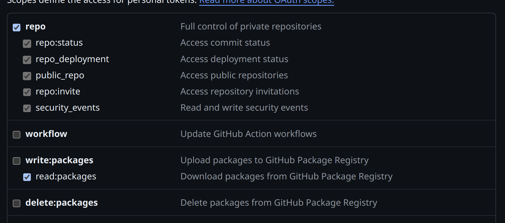
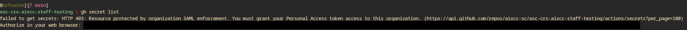
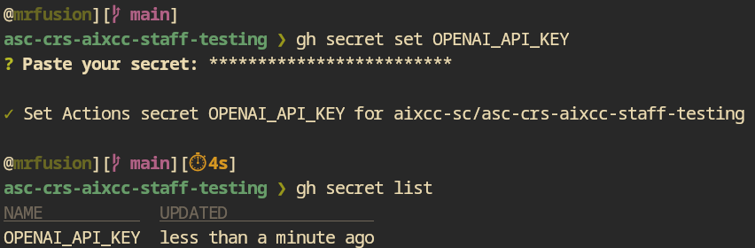

Run `docker compose run --rm crs <project_folder> <cpv_folder> <llm1> <llm2>`
e.g. `docker compose run --rm crs nginx-cp-full cpv2 o1-preview`


# OLD
# CRS Sandbox

This repository, the `CRS Sandbox` includes a [./compose.yaml](./compose.yaml) file.
This file is the only resource competitors will have for infrastructure automation at competition time.
Environment variables and secrets will be injected into [./compose.yaml](./compose.yaml)
from each competitor private copy of the `CRS Sandbox`.

Competitor SSO accounts to GitHub will be limited to a basic set of actions for making modifications and merging PRs within the GitHub repository.

## Reporting Bugs & Issues

Competitors should use GitHub issues to report bugs on the respective repositories.

Competitors are also welcome to comment in tickets assisting others.

We encourage all competitors to read through issues (open & closed) within the following repos.

- [CRS Sandbox](https://github.com/aixcc-sc/crs-sandbox/issues)
- [CP Sandbox](https://github.com/aixcc-sc/cp-sandbox/issues)
- [Mock CP](https://github.com/aixcc-sc/mock-cp/issues)
- [Competition API (cAPI)](https://github.com/aixcc-sc/cAPI/issues)

## Evaluation Window

### Phase 1 - GitHub Actions Passing

Date: 2024-05-30

On the above date, teams will be provided access to their private CRS repositories.

This repository will be generated from the CRS Sandbox reference repository which will be treated as the template repository.

Merging into main will require the workflows specified in `.github/workflows/evaluator.yml` and `.github/workflows/package.yml` to pass.

Competitors MUST release at least one version of their CRS during Phase 1 to validate their package workflow correctly executes.

Failure to do so will prevent a team's CRS from moving forward to Phase 2.

During Phase 1, teams must use their own secret keys and tokens to access collaborator resources
(LLM APIs) and authenticate against GitHub.

#### Interpreting Results in GitHub Actions

The job that evaluates the CRS's performance is part of the [CRS Evaluator](https://github.com/aixcc-sc/crs-sandbox/actions/workflows/evaluator.yml) and is called `run-validate-crs-submissions`.

It runs the CRS as defined in the [./compose.yaml](./compose.yaml) and evaluates its submitted vulnerability discoveries and generated patches.
Check the output of the validation steps, CRS submission log step, and CRS logs step for introspection into what happened.



<https://github.com/aixcc-sc/crs-sandbox/assets/165228747/f758d4cf-c597-41f3-b2c8-986250e954e3>

### Phase 2 - Automated Execution of your CRS

Date: 2024-06-21

On the above date, the AIxCC Game Architecture team will automatically execute competitors CRSs against a subset of published challenge problems.

The CRS MUST be released via [GitHub Release](https://docs.github.com/en/repositories/releasing-projects-on-github/managing-releases-in-a-repository)
and you MUST merge at least one pull request with a passing Evaluator workflow.

Competitors must release new versions of their CRS with an updated tag from `main` after the start of Phase 2 in order to trigger provisioning of their cluster.

Teams MUST merge the automated upstream pull requests in their repos OR rebase for CRS Sandbox version >= `v2.5.0`.

With each new release of a competitors CRS it will be automatically provisioned.

Only the latest semantic version of a competitors CRS that is properly tagged from `main` will be tested in Phase 2.

During Phase 2, secret keys and tokens for collaborator resources (LLM APIs) and GitHub access will
be set by the AIxCC infrastructure team.

Competitors will recieve access to a live vCluster environment at the start of Phase 2.

Competitors will be able to evaluate their CRS in this environment each time they make a new release of their CRS.

The vCluster environment will use the same SSO from the [AIxCC Dashboard](https://dashboard.aicyberchallenge.com).

We plan to add another button to the Dashboard for this environment soon.

Competitors MUST modify their PAT to add `repo` and `read:packages` level access to their classic PAT.



Competitors MUST add their PAT with the GitHub CLI with the name `GHCR_PULL_TOKEN`.
They may do this by running `gh variable set GHCR_PULL_TOKEN` and adding the PAT from above.

The process for creating the PAT is outlined under [GitHub Personal Access Token](#github-personal-access-token).

However, once we announce Phase 2 is live, teams will be able to log into their CRS at

[https://vcluster-platform.aixcc.tech/login](https://vcluster-platform.aixcc.tech/login)

During competition, CRSs may only submit a single working vulnerability discovery on any single
commit, and must use that issued CPV UUID for any generated patches.  Any further VDSs will be
rejected as duplicates.  During phase 2, however, **duplicate submissions will not be rejected** in
order to facilitate rapid CRS testing.  We may turn rejection back on towards the end of phase 2.

By modifying [config/cp_config.yaml](config/cp_config.yaml), competitors can change the CPs
presented to their CRS during phase 2.

<https://github.com/aixcc-sc/crs-sandbox/assets/165228747/771850a7-7019-4199-aa3f-c705bcffe37d>

## Docker Images

Competitors MUST push all container images that are contained in [compose.yaml](./compose.yaml) to their CRS repository.

All container images MUST contain a tag.

Docker Compose services which contain a `build` section MUST be added to [package.yaml](./.github/workflows/package.yml).

If your solution is referencing a public container like PostgreSQL or MongoDB, you MUST push this image to your CRS repository.

You MUST push these images with a tag to your CRS OCI repository and reference this image using the `ghcr.io` link.

GitHub has the following [Container Registry](https://docs.github.com/en/packages/working-with-a-github-packages-registry/working-with-the-container-registry) instructions.

Failure to follow these steps will prevent your CRS images from being able to execute at the competition.

Competitors SHOULD use a tag similar to `:${RELEASE_TAG-v1.0.0}` for all images in their [./compose.yaml](./compose.yaml) that are built
and pushed automatically with [.github/workflows/package.yml](.github/workflows/package.yml).

This will make releases update automatically in the Kubernetes resources.

## CRS Constraints on Docker and Virtualization

In the competition environment, a CRS is expected to use Docker (via `run.sh`)
to exercise the CPs that are packaged and configured to be built, tested, and
patched using the provided Docker container.

One CP (the public Linux kernel CP) includes `virtme-ng` in its CP-specific
Docker container for the purposes of testing the built kernel.

The `virtme-ng` program will automatically use `/dev/kvm` for acceleration if it is present and the CRS is running as root [See Linux CP #10](https://github.com/aixcc-sc/challenge-001-linux-cp/issues/10#issuecomment-2186565915).

Competitors are permitted to add `privileged: true` to any container under [./compose.yaml](./compose.yaml).

The Game Architecture team has confirmed the CRS execution environment supports nested virtualization for KVM.

There is no need or support for competitors to map devices directly, they must add the `privileged: true` to containers which need it.

## Environment Variables & GitHub Secrets

Each competitor CRS repository will come pre-packaged with a list of GitHub secrets and environment
variables. Teams may change the values of these secrets (e.g. to their own collaborator API keys);
however, teams must not change the variable names. Also, teams must ensure their services use the
core variables related to the iAPI and LiteLLM connections.

For local development and during Phase 1 of the Evaluation Window, competitors are expected to
use / provide their own keys and secrets. During subsequent phases of the evaluation window
and at competition, the AIxCC infrastructure team will override these values with their own.

There are currently 5 LLM Provider environment variables declared but not populated in example.env, which will be populated at competition time:

- `OPENAI_API_KEY`
- `AZURE_API_KEY`
- `AZURE_API_BASE`
- `GOOGLE_APPLICATION_CREDENTIALS`
- `ANTHROPIC_API_KEY`

Note: For local development, the [./sandbox/example.env](config/example.env) file should be
copied to `./sandbox/env`. This file is included in the `.gitignore` so competitors don't
accidentally push it to their repository.

Also note: `GOOGLE_APPLICATION_CREDENTIALS` does not directly contain the Google credential. It
contains a path to `vertex_key.json`, which contains the actual credentials.  To get the content of
`vertex_key.json`, use the [instructions to create a GCP Service
Account](https://docs.litellm.ai/docs/providers/vertex#using-gcp-service-account) in combination
with [this document about creating the credential file
itself](https://cloud.google.com/docs/authentication/application-default-credentials#personal).

*TBD* - These variables and the LiteLLM configuration file are not yet complete. This will be released in a CRS sandbox update.
We will continue iterating on the CRS sandbox as we grow closer to the competition in order to support newer versions of components.

Please see the competition rules and technical release as the cut off dates for changes will be described there.

### Setting GitHub secrets and variables with competitor repository permissions

Using the [GitHub CLI](https://cli.github.com/), you are able to set repository-level secrets
despite not being able to view or edit them in the web UI.

Your GitHub Classic PAT will need the `Full control of private repositories` permission, and you
will need it set in the `GITHUB_TOKEN` environment variable.  Once you have that configured, try `gh
secret list`.  You might get a 403 error requiring SSO sign-in:



Open the link and complete the SSO flow.  Then you should be able to use `gh secret set` to set
secrets on your repository and `gh secrets list` to show which ones exist and when they were most
recently set.

You can now also set variables with `gh variable set MY_EXAMPLE_VARIABLE` and list with `gh variable list`

The [GitHub CRS Validation workflow](./.github/workflows/evaluator.yml) expects the repo-level
secrets to have the same names as in `sandbox/env` (`OPENAI_API_KEY`, etc). The only exception to
this is Google's LLM credential, which should be stored in `VERTEX_KEY_JSON`.



## LiteLLM Models Supported

| Provider  | Model                  | Pinned Version              | Requests per Minute (RPM) | Tokens per Minute (TPM)  |
| --------- | ---------------------- | --------------------------- | ------------------------- | ------------------------ |
| OpenAI    | gpt-3.5-turbo          | gpt-3.5-turbo-0125          | 800                       | 80,000                   |
| OpenAI    | gpt-4                  | gpt-4-0613                  | 200                       | 20,000                   |
| OpenAI    | gpt-4-turbo            | gpt-4-turbo-2024-04-09      | 400                       | 60,000                   |
| OpenAI    | gpt-4o                 | gpt-4o-2024-05-13           | 400                       | 300,000                  |
| OpenAI    | text-embedding-3-large | text-embedding-3-large      | 500                       | 200,000                  |
| OpenAI    | text-embedding-3-small | text-embedding-3-small      | 500                       | 200,000                  |
| Anthropic | claude-3-sonnet        | claude-3-sonnet-20240229    | 1,000                     | 80,000                   |
| Anthropic | claude-3.5-sonnet      | claude-3-5-sonnet-20240620  | 1,000                     | 80,000                   |
| Anthropic | claude-3-opus          | claude-3-opus-20240229      | 1,000                     | 40,000                   |
| Anthropic | claude-3-haiku         | claude-3-haiku-20240307     | 1,000                     | 100,000                  |
| Google    | gemini-pro             | gemini-1.0-pro-002          | 120                       | pending (as of 20240610) |
| Google    | gemini-1.5-pro         | gemini-1.5-pro-preview-0514 | 120                       | pending (as of 20240610) |
| Google    | textembedding-gecko*   | textembedding-gecko@003*    | pending (as of 20240610)  | pending (as of 20240610) |

Note: OpenAI Embedding models have not currently been released in more than a single version, thus pinned/name strings are identical.

Some OpenAI models will also be matched by an Azure-hosted version:
| Provider | Model                  | Pinned Version         | Requests per Minute (RPM) | Tokens per Minute (TPM) |
| -------- | ---------------------- | ---------------------- | ------------------------- | ----------------------- |
| Azure    | gpt-3.5-turbo          | gpt-3.5-turbo-0613     | 100                       | 80,000                  |
| Azure    | gpt-4o                 | gpt-4o-2024-05-13      | 100                       | 300,000                 |
| Azure    | text-embedding-3-large | text-embedding-3-large | 100                       | 120,000                 |
| Azure    | text-embedding-3-small | text-embedding-3-small | 100                       | 120,000                 |

Competitors will be able to freely request the model they like by the Model name in chart above, plus a prefix "oai-" or "azure-".
Ex. "oai-gpt-4o".
This was done because of performance differences between the models as hosted on OAI vs Azure infrastructure.
The models themselves are guaranteed to be identical but no such promises can be made as regards supporting provider infrastrcture.

Note: OAI Embedding models have not currently been released in more than a single version.

These models are all utilized by hitting the LiteLLM /chat/completions endpoint, specifying model and message using the OpenAI JSON request format.
This is the tentative complete list of models.

The Requests per Minute (RPM) and Tokens per Minute (TPM) columns in the table above are
rate limits that are enforced per CRS for the ASC. The LiteLLM proxy will be responsible for
implementing these limits. The RPM and TPM limits are enforced per model, not in aggregate across
models or providers.

Note: the "\*" next to model "textembedding-gecko" indicates this model target is still in flux.
The AIxCC infrastructure team is still waiting on LiteLLM to finalize support for the model
"text-embedding-004". If this newer model is not integrated in time to support its use during the
ASC, then the fallback will likely be "textembedding-gecko@003".

## Local Development

We recommend using Ubuntu 22.04 LTS for CRS Sandbox development and will be unable to investigate issues with other base operating systems.

### GitHub Personal Access Token

In order to work with the CRS Sandbox you must setup your GitHub personal access token or PAT following these steps.

1. Configure a personal access token (PAT) with `repo` (all checks) and `read:packages` permission by following this [guide](https://docs.github.com/en/packages/working-with-a-github-packages-registry/working-with-the-container-registry#authenticating-with-a-personal-access-token-classic)
2. Authorize the generated PAT for the `aixcc-sc` organization by this [guide](https://docs.github.com/en/enterprise-cloud@latest/authentication/authenticating-with-saml-single-sign-on/authorizing-a-personal-access-token-for-use-with-saml-single-sign-on)
3. Run `echo "example-token-1234" | docker login ghcr.io -u USERNAME --password-stdin` replacing example-token-1234 with your generated PAT.
4. Confirm that you see `> Login Succeeded` in your output from step #3.
5. Competitors MUST add this key as a repository variable called `GHCR_PULL_TOKEN`.
This MUST be a variable and NOT a secret. The Game Architecture team will use this variable to pull your repository images at competition time.

### GitHub SSH Key

1. Generate an SSH key by following this [guide](https://docs.github.com/en/enterprise-cloud@latest/authentication/connecting-to-github-with-ssh/generating-a-new-ssh-key-and-adding-it-to-the-ssh-agent)
2. Upload the generated SSH key to your AIxCC GitHub account by following this [guide](https://docs.github.com/en/enterprise-cloud@latest/authentication/connecting-to-github-with-ssh/adding-a-new-ssh-key-to-your-github-account)
3. Follow this [guide](https://docs.github.com/en/enterprise-cloud@latest/authentication/authenticating-with-saml-single-sign-on/authorizing-an-ssh-key-for-use-with-saml-single-sign-on)
to authorize the SSH key for the `aixcc-sc` organization

### Precommit

This repository has a [.pre-commit-config.yaml](.pre-commit-config.yaml) file for assisting with local development.

While competitors are not required to use this, they may find it easier to pass the mandatory evaluation checks.

You can install the command-line tool by going [here](https://pre-commit.com/#install)

### Dependencies

Most dependencies in this repository can be automatically managed by `mise`, but you'll have to install the following yourself:

- docker >= 24.0.5
- docker-compose >= 2.26.1
- GNU make >= 4.3

We've added a Makefile target `make install` which will setup the required dependencies.
This is the exact same target used by the GitHub workflow evaluator.

Additionally, you will need permissions to interact with the Docker daemon.
Typically this means adding your user to the `docker` group.

### Working with Docker

The `crs-sandbox` contains its own Docker daemon inside of a container. With `make up` this runs docker-in-docker.
However with Kubernetes via `make k8s` and at competition this runs the `dockerD daemon container within Kubernetes.
By default this is not accessible on the host machine, but you can enable the
port mapping by editing
[`./compose_local_overrides.yaml`](./compose_local_overrides.yaml).  Note that
by doing this, you are exposing the Docker daemon on your host without
authentication enabled.

Once you've done that, set `DOCKER_HOST=tcp://127.0.0.1:2375`.

```bash
export DOCKER_HOST=tcp://127.0.0.1:2375
docker logs <container name>
```

#### Install dependencies

`make install`

### Data Sharing & Volumes

A CRS will find the CPs under evaluation in the volume indicated by the environment variable
`${CP_ROOT}`. 
The volume indicated by the environment variable `${CRS_SCRATCH_SPACE}` will be writable
by the CRS and CPs. Moreover, this volume can be shared among the CRS services as a
shared file system. It is the responsibility of the CRS developers to ensure that
use of this shared volume is coordinated between its services to prevent data corruption
via collisions or race conditions. No other folders or volumes will be shared between
containers for competitor use during competition.

### Using Make

A Makefile has been provided with a number of a commands to make it easy to clone the exemplar repos, stand up the environment, and a variety of other actions.

Copy `sandbox/example.env` to `sandbox/env` and replace the variables with your own for local development.

**If you do not have working GitHub credentials that can pull images from GHCR, `make up` will fail.**

```bash
cp sandbox/example.env sandbox/env
```

`make cps` - clones the exemplar challenges into local `./cp_root` folder (the source folder for `${CP_ROOT}`)
`make up` - brings up the development CRS Sandbox, you can visit <http://127.0.0.1:8080/docs> to see the iAPI OpenAPI spec.
`make down` - tears down the development CRS Sandbox

See [Makefile](./Makefile) for more commands

`make force-reset` - performs a full Docker system prune of all local docker containers, images, networks, and volumes. This can be useful if you accidentally orphaned some docker process or other resources.


# AICD

Note that this readme is not a substitute for the original README.md provided by the AIxCC organizers.

### Extending CRS functionality

The interfaces with the various components can be found in [api](./src/api).
To interact with the challenge projects, the [api.cp.ChallengeProject](./src/api/cp.py) class exposes the relevant
functionality as methods.
The code that interacts with the LLM APIs can be found in [api/llm/](src/api/llm).

To add new code to the CRS, edit the appropriate file in the [pipeline](./src/pipeline) folder.

For example, to add code to the vulnerability discovery pipeline:

- add a function in [vuln_discovery.py](./src/pipeline/vuln_discovery.py) or a method to the `VulnDiscovery` class
- call the new function in `VulnDiscovery.run`

For debugging, logger output is provided.
By default, only `INFO` and up are printed to the Docker attached tty.
The full logs, including `DEBUG` and logs from underlying libraries such as git commands and network requests to
litellm, are printed to `/crs_scratch/crs.log`.

#### Tooling

The project includes some non-exhaustive type hinting, which is checked through GitHub actions.
It is there to help, not hinder so if it highlights something being wrong, it's likely a potential source of buggy behaviours.
You can run it at any time using `pyright -p crs/src/`.
It also includes `isort` and `black` to autoformat your code.
You can run these at any time using `isort crs/src` and `black crs/src`.

Black, isort, and pyright have been added to the [.pre-commit-config.yaml](.pre-commit-config.yaml).
Run `pre-commit install` to run the pre-commit checks before you commit.

Black, isort, and pyright are checked on the CI pipeline but will not block a merge.


##### VSCode
If you're using VSCode, you can use extensions to automate the process (which should show up as recommended):
- https://marketplace.visualstudio.com/items?itemName=ms-python.isort
- https://marketplace.visualstudio.com/items?itemName=ms-python.black-formatter
- https://marketplace.visualstudio.com/items?itemName=ms-python.vscode-pylance (includes pyright)

The `.vscode` folder contains a sample settings file.
Run `cp .vscode/settings.json.sample .vscode/settings.json` to use the settings.
Modify [.vscode/settings.json](./.vscode/settings.json) according to the comments to get autoformatting on save.

### Setting up the CRS on a new machine

- Install docker engine >= 24.0.5
  - uninstall any potential existing Docker packages by running
    `for pkg in docker.io docker-doc docker-compose docker-compose-v2 podman-docker containerd runc; do sudo apt-get remove $pkg; done`
  - Follow https://docs.docker.com/engine/install/ubuntu/#install-using-the-repository
  - Enable managing Docker as a non-root user: https://docs.docker.com/engine/install/linux-postinstall/#manage-docker-as-a-non-root-user
- Install GNU make >= 4.3
  - `sudo apt install make`
- Install mise by following https://mise.jdx.dev/getting-started.html
  - `curl https://mise.run | sh`
  - `echo 'eval "$(~/.local/bin/mise activate bash)"' >> ~/.bashrc`
  - `echo 'export PATH="$HOME/.local/share/mise/shims:$PATH"' >> ~/.bash_profile`
  - if you cannot run `mise --version` then uninstall using `~/.local/bin/mise implode` and start again :/
- We will supply you with an SSH key which you will need to use to pull and push to the repo:
  - move the key to the `~/.ssh/` directory
  - `chmod 600 ~/.ssh/id_rsa_aicc`
  - `eval "$(ssh-agent -s)"`
  - `ssh-add ~/.ssh/id_rsa_aicc`
- Run `echo "vm.mmap_rnd_bits=28" | sudo tee -a /etc/sysctl.conf` to avoid issues with address randomisation
  (see https://github.com/aixcc-sc/cp-sandbox/pull/28 and linked issues for extra details)
- Clone the repo by running `git clone git@github.com:aixcc-sc/asc-crs-mindrake.git`
- `cd` into repo directory and run `mise install` to install dependencies
- run `cp sandbox/example.env sandbox/env` and modify `sandbox/env` as follows:
  - generate a new personal access token (PAT) (https://github.com/settings/tokens) with `read:packages` permissions.
  - authorise the token by clicking "Configure SSO" next to it and then "aixcc-sc".
    - 
  - include our GitHub username (`auth0-660bd3c14d2d6436de9169f3_aixcc`) and personal access token in the
    `GITHUB_USER` and `GITHUB_TOKEN` variables, respectively, in the `env` file
  - fill in API keys for the LLMs (`ANTHROPIC_API_KEY`, `AZURE_API_KEY`, `OPENAI_API_KEY`)
  - set `VERTEX_PROJECT=sunlit-pixel-426710-s7` and `VERTEX_REGION=us-central1`
  - populate [sandbox/litellm/vertex_key.json](../sandbox/litellm/vertex_key.json) with the Google/VertexAI credentials
    in JSON format
    - you cannot push changes to files inside `sandbox`; to make git ignore this change and avoid any accidental commits
      `git update-index --skip-worktree sandbox/litellm/vertex_key.json`
  - if you are usure what info you should put there, please let us know
- (OPTIONAL) To enable more debugging information:
  - run `cp crs/src/env.example crs/src/env`
  - modify `crs/src/env` as follows:
    - to enable more verbose logging from the OpenAI client, which is what LangChain uses to talk to LiteLLM, set `OPENAI_LOG=debug`
    - to enable [LangSmith](https://docs.smith.langchain.com/) integration to help with debugging LangChain:
      - log into https://smith.langchain.com, create a PAT, and add it to `LANGCHAIN_API_KEY`
      - to enable logging, such as when changing or debugging LLM code, change `LANGCHAIN_TRACING_V2` to `true`
      - change it back to `false` when no longer required to avoid using up the limited quota on our free account
- run `docker login -u auth0-660bd3c14d2d6436de9169f3_aixcc -p <your pat> ghcr.io` to access the competition images
  - _Note_: challenge images are handled by the `load-cp-images` container and are placed into the `dind` cache
    (`dind_cache`).
    - if you want to run Docker commands inside the `dind` container, uncomment the port bindings for `dind`
      in [compose_local_overrides.yaml](../compose_local_overrides.yaml) and run `make up`.
      Prefixing Docker commands with `DOCKER_HOST=tcp://localhost:2375` will let you run commands using the Docker
      instance inside the containers, e.g. `DOCKER_HOST=tcp://localhost:2375 docker images` to check which CP images are
      available.
- run `c=crs make up-attached` to bring up th CRS server with attached output stream
  - if this fails and brings up a permission error for `/var/run/docker.sock` despite running the instructions for
    running Docker as a non-root user, restart your VM and try this command again.
  - this will bring up the other containers in the background and keep them running after the CRS exits, including:
    - LiteLLM proxy (port 8081 on host)
    - dind (Docker-in-Docker)
  - to make re-running the CRS easier, consider adding `alias crs="c=crs make up-attached"` to your `~/.bashr`/`~/.zshrc`/etc.


### Development workflow

1. Do any work on new branches called `<name>/<short description>`.
2. When you want it tested against the GitHub actions, open a draft pull request (PR) into the `main` branch.
3. When it's ready to be merged into `main`, press the "Ready for review" button.
4. Ask for a quick code review in the channel to
   1. get a second pair of eyes on your code;
   2. make changes visible to everyone else so there is less potential for toe stepping/duplicate effort.
5. Once you had some peer feedback, hit merge on the GH PR if all tests are green and there's no comments saying you
   should make changes.
6. Delete branch and start any new work from _1._ after you pull the latest changes to main.

#### AIxCC Challenge projects

- CP Sandbox: https://github.com/aixcc-sc/cp-sandbox.git
  - The generic structure of a CP repo
- Mock CP: https://github.com/aixcc-sc/mock-cp.git
  - A very basic CP
  - Contains:
    - Mock CP Source: https://github.com/aixcc-sc/mock-cp-src.git
      - Source code for Mock CP (in C)
- Jenkins CP: https://github.com/aixcc-sc/challenge-002-jenkins-cp.git
  - CP for Jenkins software
  - Contains:
    - Jenkins CP Source: https://github.com/aixcc-sc/challenge-002-jenkins-source.git
      - Source code for Jenkins CP (in Java)
    - Jenkins Plugin: https://github.com/aixcc-sc/challenge-002-jenkins-plugins.git
      - Repo with a plugin used by the Jenkins CP
- Linux Kernel CP: https://github.com/aixcc-public/challenge-001-exemplar.git
  - Contains:
    - Linux Kernel CP Source: https://github.com/aixcc-public/challenge-001-exemplar-source.git
      - Source code for Linux kernel (in C)
- Nginx CP: https://github.com/aixcc-sc/challenge-004-nginx-cp
  - Contains:
    - https://github.com/aixcc-sc/challenge-004-nginx-source
      - Source code for Nginx proxy (in C)
